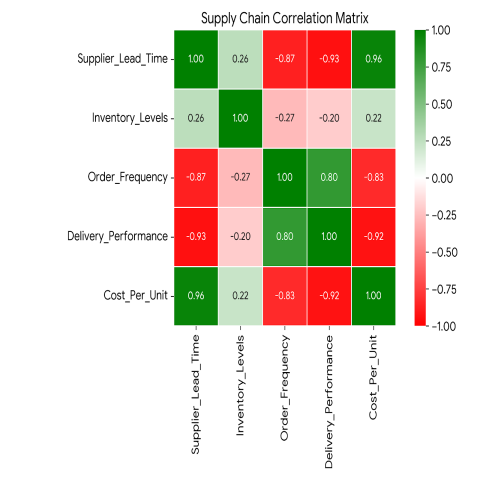

<!-- _class: lead -->
# Technical Documentation  
### Using Marp for Software Product Docs  
#### **21f2000973@ds.study.iitm.ac.in**

---

# Why Marp?

- Version-control friendly  
- Converts to **PDF, PPTX, HTML**  
- Linux-friendly, CI-friendly  
- Supports **math, code, directives, themes**  
- Excellent for engineering documentation

---

<!-- Background Image Slide -->

# Background Image Slide  
### (Using `heatmap.png` from repository root)

This slide now uses the proper Marp syntax:

